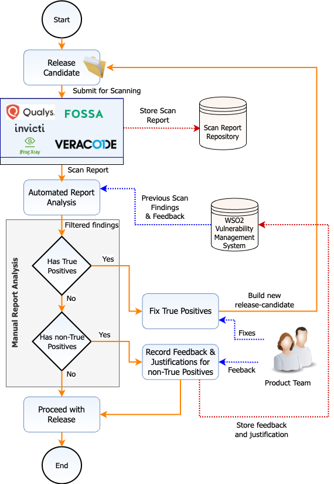

# Security Software Development Process

Version: 2.2 | Date: 19th  Mar 2020

___

Security is not an afterthought at WSO2. It's an integral part of each phase in the development life cycle. This makes sure security vulnerabilities are identified and mitigated as early as possible.

{ .post-image }

[WSO2 Secure Engineering Guidelines](../secure-engineering/owasp-top-10/example/) provide the overall security guidance during design, development and code review phases. A group of security leads review designs of new features and also review the code to make sure that engineers are adhering to the guidelines set forth. Some security checks are further enforced when engineers commit the code to the WOS2 maintained code repositories. 

Furthermore, before a product release, there are mandatory security scans that look at the security of the release candidate in different perspectives. All the security findings are securely stored into a centralized systems for future reference. 

This document further explains, each individual phase of this overall process, carried out in order to produce secure software.

* [Design Phase](#design-phase)
* [Development Phase](#development-phase)
    - [Developer Self-review](#developer-self-review)
    - [Code Reviews](#code-reviews)
* [Release Process](#release-process)
    - [Static Code Analysis](#static-code-analysis)
    - [Dynamic Analysis](#dynamic-analysis) 
    - [Third Party Dependency Analysis](#third-party-dependency-analysis)
    - [Mandatory checks during releases](#mandatory-checks-during-releases)
* [Vulnerability Management](#vulnerability-management)

### Design Phase

New feature developments and modifications to the existing features must go through a thorough design review/s that evaluates the security aspects of the corresponding component. 

The software architects and security leads of the respective product domains must attend these reviews. Following are some questions that are taken into consideration during these reviews. 

* What are the interactions with other components in the system and how those interactions happen?
* What are the access and trust boundaries of the component?
* Who should be able to consume the functionalities exposed by the component?
* What level of authentication and authorization is required by the component, and what is the granularity of the permissions?
* What are the session management related requirements? E.g. is forgot password required?
* Are there configuration elements that includes confidential data? If so, how should they be protected?
* Are there confidential data stored in the database? If so, how should they be protected?
* Is the strength of cryptographic keys and algorithms to be used on par with the latest best practices?
* Is adequate amount of information being logged to understand a security related incident.

### Development Phase

#### Developer Self-review

Before any code review, all the engineers must do a self code review. During development tasks and also during the self-code reviews, it is essential to follow the guidelines set forth by [WSO2 Secure Engineering Guidelines](../secure-engineering/owasp-top-10/example/).

Find Security Bugs Spotbugs plugin is recommended to be used in development environments.

Before sending any GItHub pull-requests (PR), developers must confirm the following workflow:

{ .post-image }

Figure 2: Developer workflow before creating a pull-request.

Relevant checks are further enforced by the GitHub pull-request template:

{ .post-image }

#### Code Reviews

Each new component must go through a set of code reviews. The participation of one or more security leads is a must for each code review. Once a code review is done, all the findings related to the security aspects must be resolved before merging the component into the code base. 

[WSO2 Secure Engineering Guidelines](../secure-engineering/owasp-top-10/example/) should be used as a guideline when reviewing the security aspect of the code. 

There are two types of vulnerabilities that are taken into consideration during a code review.

* Exploitable vulnerabilities
* Security weaknesses / defence in depth issues

The exploitable vulnerabilities have a direct impact and provides an attacker more privileges than allowed. The second type is not directly exploitable and can be used in conjunction with exploitable vulnerabilities to aggravate the impact of an attack. Following lists out some of the most common vulnerabilities, introduced due to bad coding practices.

* Cross-Site Scripting (XSS) attack
* Cross-Site Request Forgery (CSRF)
* HTTP Response Splitting (Header Injection)
* SQL Injection

 Following are some questions that are taken into consideration during these reviews. 

* Are all the entry points and trust boundaries identified by the design?
* Is input validation being applied whenever input received from outside the current trust boundary?
* Has all input validation applied in a allowlisting fashion which includes data types, formats, minimum/maximum lengths?
* Does the application perform canonicalization of data prior to validating the inputs?
* Does the application apply defense in depth to the input validation strategy?
* All XML input validated against an agreed schema?
* Is output that contains externally supplied input subjected to the correct type of encoding?
* Do we log any confidential data?
* Do we encrypt or allow encrypting any of the confidential data before being stored?
* Can we encrypt any confidential data read from configuration files?
* PreparedStatement is properly used whenever write to or read from a database?
* Does the application store passwords and other confidential data in char[] and not as Strings?
* Does the default values carry the most secure option?

### Release Process

A release candidate goes through three types of security checks, to make sure that the product is in a secure state.

#### Static Code Analysis
Static Code Analysis is used to identify possible vulnerabilities within source code, by using techniques such as [Taint Analysis and Data Flow Analysis](https://owasp.org/www-community/controls/Static_Code_Analysis).

Apart from the [Find Security Bugs](https://find-sec-bugs.github.io/) Spotbugs plugin which is used at the development phase, WSO2 uses [Veracode](https://www.veracode.com/products/binary-static-analysis-sast) commercial static analyzer for this purpose.

Please note that the security issues relevant to the third-party dependencies are covered separately with the [Third Party Dependency Analysis](#third-party-dependency-analysis) effort. Therefore, the source code of the third-party dependencies are excluded from the static code analysis.

#### Dynamic Analysis 
Dynamic Analysis is used to searching for software vulnerabilities when the code is in operation mode. The analysis is performed when the application is running.

[WSO2 uses Qualys Web Application Scanner (Qualys WAS)](https://www.qualys.com/apps/web-app-scanning/) for dynamic security scanning.

#### Third Party Dependency Analysis
Security vulnerabilities identified in the third-party dependencies may affect the security of the product. WSO2 prevent such security impacts that could occur due to third party dependencies at few stages.  

It is essential to make sure third party dependencies with known security vulnerabilities are not introduced newly. Therefore, with any "third party dependency approval request" it is essential to attach [OWASP Dependency Check](https://owasp.org/www-project-dependency-check/) report, adhering to the **[Introducing New External Dependencies](https://wso2.com/technical-reports/wso2-secure-engineering-guidelines#A291)** section of the **WSO2 Secure Coding Guidelines**. 

New security vulnerabilities related third party dependencies may get identified and fixed in any given time. Therefore, it is essential to continuously monitor different sources to identify if a new vulnerability has been identified or fixed. 

WSO2 uses [OWASP Dependency Track](https://owasp.org/www-project-dependency-track/) for this purpose with product versions released after Q1 2020. The [National Vulnerability Database (NVD)](https://nvd.nist.gov/vuln) is queries for third-party dependency issues and alerts will be generated if a new issue has been identified. It is required to update the dependency or add a mitigation comment explaining why the relevant vulnerability is not application to the product.

#### Mandatory checks during releases

{ .post-image align=center }

To request a security scan (Veracode, Qualys or Dependency Track), product teams create a JIRA in the internal security JIRA project, attach the related product pack, and send an email notification to <security-leads-group@wso2.com>, with a reference to the corresponding JIRA. 

Even though security scans can be scheduled at any time, based on the requests from the product teams, it is mandatory to perform all three scan types (static scan, dynamic scan, third-party dependency scan) before a product release. This involves:

* Get the version to be released scanned using the scanner. 
* Prepare feedback report for any **false positive**, **not a threat**, **not applicable** or **already mitigated** findings. The feedback should include:
    - Comment on why the issue is categorized as such.
    - Details about the use case of the relevant logic.
    - Details about the impact of the reported issue. 
* Fix all **true positive** issues identified.
* Rescan the product before the release vote, if complex changes have occurred between the initial security scan and the actual release vote, preventing manual verification of security fixes.

If any of the aforementioned items are not complete, Platform Security Team will down vote the release, preventing product from getting released.

### Vulnerability Management

All issues reported by static code analyzers, dynamic scanners and dependency scans will be uploaded into a centralized Vulnerability Management System (VMS). WSO2 uses [OWASP Defect Dojo](https://owasp.org/www-project-defectdojo/) as the centralized VMS. 

This centralized VMS can be used to identify duplicates in future reports and also to automatically provide feedback for security scan reports sent by WSO2 customers, largely reducing the manual effort required in analyzing security reports.
