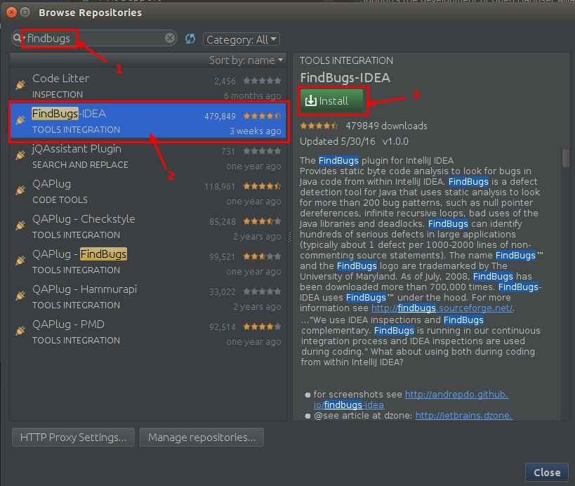
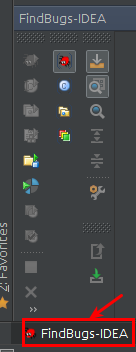
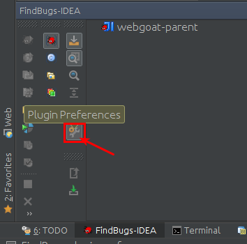
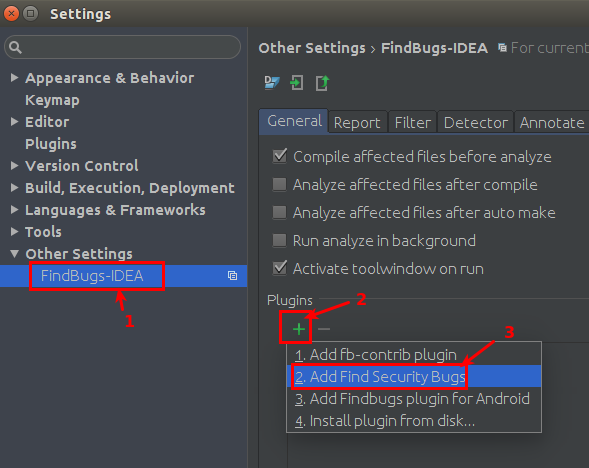
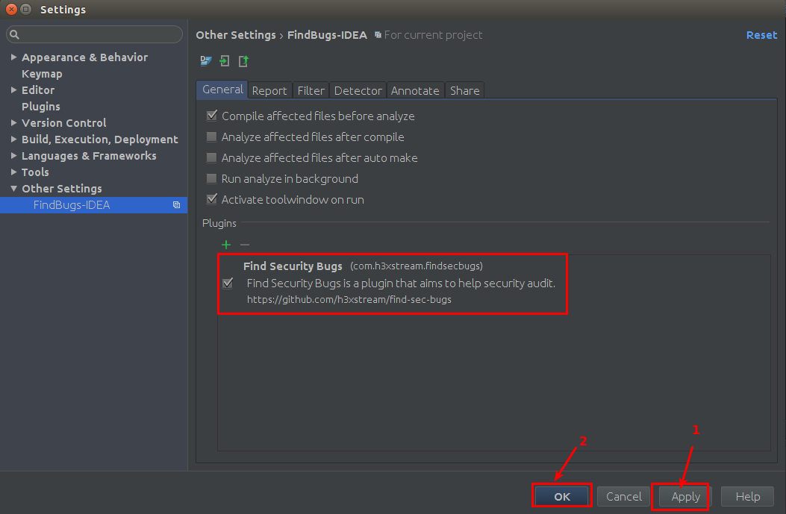
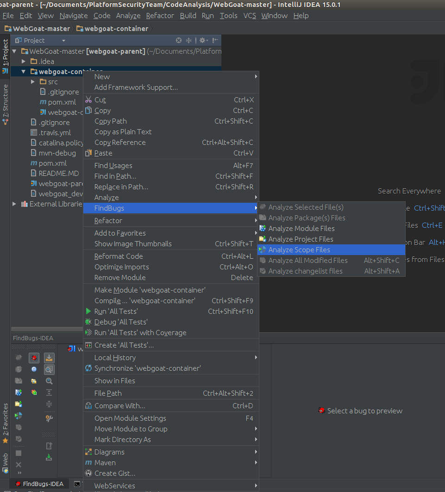
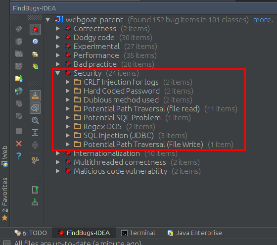
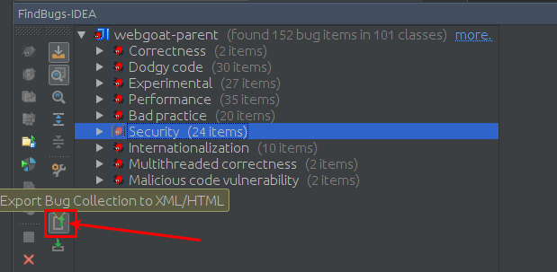
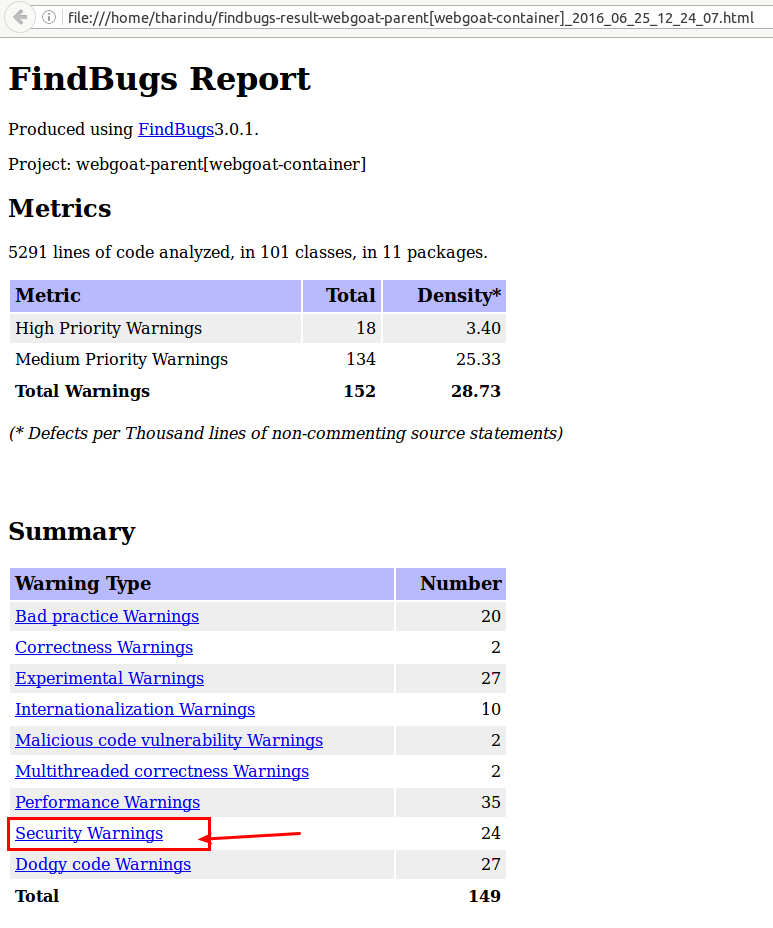
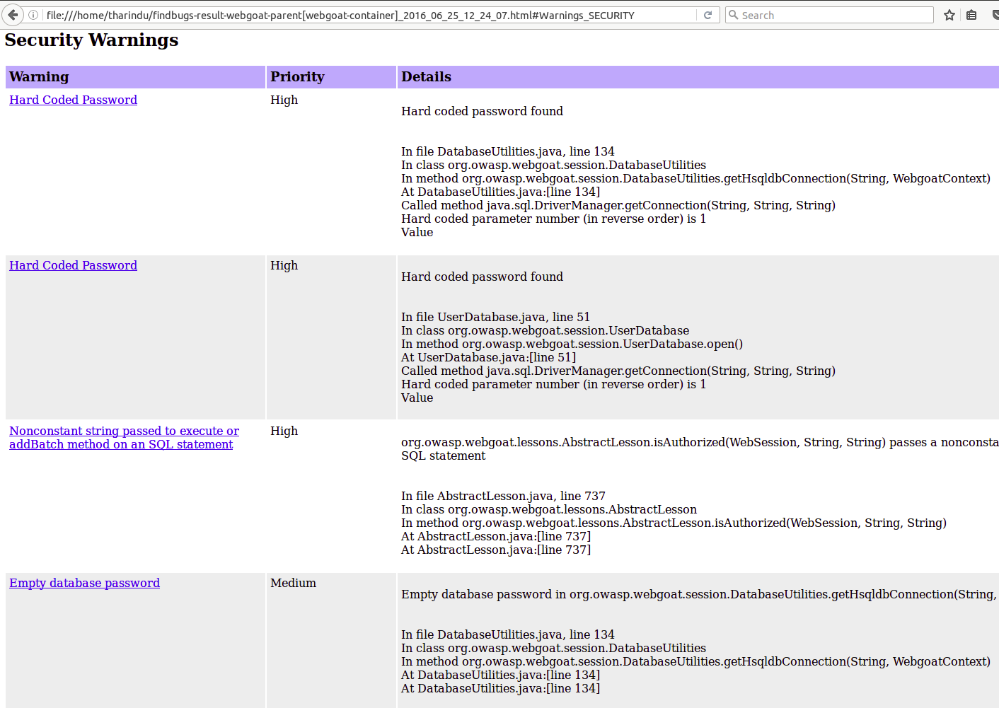

# Static Code Analysis using FindSecurityBugs

Version: 1.2

___

## Introduction
This document provides details of all necessary steps for configuring FindBugs[^1] and Find Security Bugs[^2] for scanning source code in order to discover security threats. 

## Installation - IntelliJ Idea - FindBugs Plugin
1. Once you open IntelliJ IDEA, go to **Configure** &rarr; **Plugins** in the opening window.

    

2. If you have already opened a project in IntelliJ IDEA, go to **File** &rarr; **Settings** and in the left panel of the Settings window, select **Plugins**.

     

3. You can install the FindBugs plugin in two ways. 
     1. If you have an internet connection, you can click the **Browser repositories** button and get the plugin installed. Search for the findbugs plugin and select **FindBugs-IDEA** and get it installed.
     2. If not you can download the FindBugs plugin for IntelliJ IDEA[^3] and go with the **Install plugin from disk** option where you can browse and provide the already downloaded plugin.

         

## Installation - IntelliJ Idea - Find Security Bug Plugin
1. Once you have installed the FindBugs plugin in IntelliJ IDEA, at the bottom of the IDE you will see the **FindBugs-IDEA** button. Upon clicking on it, you can see all its settings, in a panel.  

    

2. Enable the **FindSecurityBugs** plugin which comes with FindBugs. This is for finding the security bugs in your code. Click the **Plugin Preferences** button.

    

3. Under the **Plugins** section of the **General** tab, click the **+** button and select **Add Find Security Bugs**.

    

4. Once the FindSecurityBugs plugin is added, click **Apply** and then **OK**.

    

5. Now we have successfully installed the FindBugs plugin in IntelliJ IDEA and also have enabled the FindSecurityBugs plugin in it. Let’s perform a static code analysis and get to know all the bugs we have in the code.

## Code Analysis
To analyze the project, right-click the project and go to **FindBugs** -> **Analyze Scope Files**. With this, the scanning will happen only under the selected folder. You can also go with **Analyze Module Files** which would scan the particular module you have selected and also **Analyze Project Files** which would scan the entire project. 

   

Once the static scan is completed, you can see the identified bugs in the **FindBugs-IDEA** panel. Since we have enabled the FindSecurityBugs plugin, it will list all the identified security issues under the **Security** category. 

   

## Report Generation 
You can export the reported bugs for further analysis. For that, click the **Export Bug Collection** to **XML/HTML** button.

A generated report is as follows:

If you go to the **Security Warnings** section, you can see a detailed explanation for each identified security issue.

## References
[^1]: [http://findbugs.sourceforge.net/](http://findbugs.sourceforge.net/)
[^2]: [http://find-sec-bugs.github.io/](http://find-sec-bugs.github.io/)
[^3]: [https://plugins.jetbrains.com/plugin/3847?pr=id](https://plugins.jetbrains.com/plugin/3847?pr=id)
