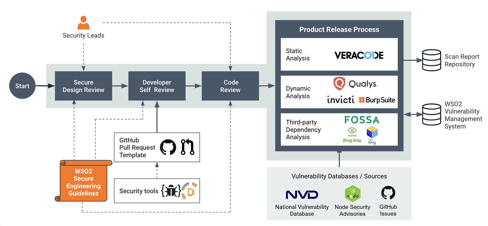
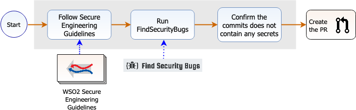

# Secure Software Development Process (SDLC)

Security is not an afterthought at WSO2. It's an integral part of each phase in the development life cycle. This ensures that security vulnerabilities are identified and mitigated as early as possible.

[WSO2 Secure Engineering Guidelines](../security-guidelines/index.md) provide the overall security guidance during the design, development and code review phases. A group of security leads review designs of new features and also review the code to make sure that engineers are adhering to the guidelines set forth. Some security checks are further enforced when engineers commit the code to the WSO2-maintained code repositories. 

Furthermore, before a product release, there are mandatory security scans that look at the security aspect of the release candidate from different perspectives. All the security findings are securely stored in a centralized system for future reference. 

This document further explains each individual phase of this overall process, carried out to produce secure software.

### Design Phase

New feature developments and modifications to the existing features must go through thorough design reviews that evaluate the security aspects of the corresponding component. 

The software architects and security leads of the respective product domains must attend to these reviews. Formal threat modeling using STRIDE-LM methodology is followed for selected features. Following are some questions that are taken into consideration during these reviews: 

* What are the interactions with other components in the system and how do those interactions happen?
* What are the access and trust boundaries of the component?
* Who should be able to consume the functionalities exposed by the component?
* What level of authentication and authorization is required by the component, and what is the granularity of the permissions?
* What are the session management-related requirements? For example, is the forgot password option required?
* Are there configuration elements that include confidential data? If so, how should they be protected?
* Are there confidential data stored in the database? If so, how should they be protected?
* Is the strength of cryptographic keys and algorithms to be used on par with the latest best practices?
* Is an adequate amount of information being logged to understand a security-related incident?

### Development Phase

#### Developer Self-review

Before any code review, all the engineers must do a self-code review. During development tasks and also during the self-code reviews, it is essential to follow the guidelines set forth by [WSO2 Secure Engineering Guidelines](../security-guidelines/index.md).

The [Find Security Bugs SpotBugs](https://find-sec-bugs.github.io/) plugin is recommended to be used in development environments.

Before sending any GitHub Pull Requests (PR), developers must confirm the following workflow:

Developer workflow before creating a pull request

Relevant checks are further enforced by the GitHub PR template:

#### Code Reviews

Each new component must go through a set of code reviews. The participation of one or more security leads is a must for each code review. Once a code review is done, all the findings related to the security aspects must be resolved before merging the component into the code base. 

[WSO2 Secure Engineering Guidelines](../security-guidelines/index.md) should be followed when reviewing the security aspect of the code. 

During a code review, two types of vulnerabilities are taken into consideration:

* Exploitable vulnerabilities
* Security weaknesses/defence in-depth issues

The exploitable vulnerabilities have a direct impact and provide an attacker more privileges than allowed. The second type is not directly exploitable and can be used in conjunction with exploitable vulnerabilities to aggravate the impact of an attack. The following lists some of the most common vulnerabilities introduced due to bad coding practices.

* Cross-Site Scripting (XSS) attack
* Cross-Site Request Forgery (CSRF)
* HTTP Response Splitting (Header Injection)
* SQL Injection

During these reviews, the following questions are considered:

* Are all the entry points and trust boundaries identified by the design?
* Is input validation being applied whenever input is received from outside the current trust boundary?
* Has all input validation been applied in an allow listing fashion which includes data types, formats, and minimum/maximum lengths?
* Does the application perform canonicalization of data prior to validating the inputs?
* Does the application apply defence in depth to the input validation strategy?
* Are all XML inputs validated against an agreed schema?
* Does an appropriate type of encoding apply to an output that includes externally supplied input?
* Do we log any confidential data?
* Do we encrypt or allow encrypting any of the confidential data before being stored?
* Can we encrypt any confidential data read from configuration files?
* PreparedStatement is properly used whenever writing to or reading from a database.
* Does the application store passwords and other confidential data in the format of `char[]` instead of `String`?
* Do the default values carry the most secure option?

### Release Process

A release candidate goes through three types of security checks to make sure that the product is in a secure state.

#### Static Code Analysis
Static Code Analysis is used to identify possible vulnerabilities within source code by using techniques such as [Taint Analysis and Data Flow Analysis](https://owasp.org/www-community/controls/Static_Code_Analysis).

Apart from the [Find Security Bugs](https://find-sec-bugs.github.io/) Spotbugs plugin which is used in the development phase, WSO2 uses the [Veracode](https://www.veracode.com/products/binary-static-analysis-sast) commercial static analyzer for this purpose.

WSO2 uses the [Trivy](https://aquasecurity.github.io/trivy/) Open-source image scanner for finding OS level vulnerabilities in WSO2 docker images.

!!! note
    The security issues relevant to the third-party dependencies are covered separately with the [Third-Party Dependency Analysis](#third-party-dependency-analysis) effort. Therefore, the source code of the third-party dependencies is excluded from the static code analysis.

#### Dynamic Analysis 
Dynamic Analysis is used to search for software vulnerabilities when the code is in operation mode. The analysis is performed when the application is running.

WSO2 uses [Qualys Web Application Scanner (Qualys WAS)](https://www.qualys.com/apps/web-app-scanning/), [Invicti](https://www.invicti.com/web-vulnerability-scanner/) and [Burp Suite Professional](https://portswigger.net/burp/pro) for dynamic security scanning.

#### Third-Party Dependency Analysis
Security vulnerabilities identified in third-party dependencies may affect the security of the product. WSO2 prevents such security impacts that could occur due to third-party dependencies at a few stages.  

It is essential to prevent the introduction of new third-party dependencies with known security vulnerabilities. Therefore, with any _third-party dependency approval request_ it is essential to attach the [OWASP Dependency Check](https://owasp.org/www-project-dependency-check/) report, adhering to the **[Introducing New External Dependencies]({{#base_path#}}/security-guidelines/secure-engineering-guidelines/secure-coding-guidlines/general-recommendations-for-secure-coding/#introducing-new-external-dependencies)** section of the [WSO2 Secure Coding Guidelines]({{#base_path#}}/security-guidelines/secure-engineering-guidelines/secure-coding-guidlines/introduction/). 

New security vulnerabilities related to third-party dependencies may get identified and fixed at any given time. Therefore, it is essential to continuously monitor different sources to identify if a new vulnerability has been identified or fixed. WSO2 uses the following tools for this analysis: 
- [FOSSA](https://fossa.com/) for scanning product distributions and application dependencies in cloud pipelines
- [JFrog Xray](https://jfrog.com/xray/) for scanning product container images
- [Trivy](https://trivy.dev/) for scanning container images in cloud pipelines

The [National Vulnerability Database (NVD)](https://nvd.nist.gov/vuln) and other proprietary databases maintained by the mentioned scanner vendors are queried for third-party dependency issues and alerts will be generated if a new issue has been identified. Updating the dependency is required. When updating the dependency is not an option due to any major complications a [CVE Justification](../security-announcements/cve-justifications/index.md) should be published explaining why the relevant vulnerability does not affect security of the products. Such justification should explain the complications related to the update process requiring such justification to be published.

#### Mandatory checks during releases

Even though security scans can be scheduled at any time, based on the requests from the product teams, it is mandatory to perform all three scan types (static scan, dynamic scan, third-party dependency scan) before a product release. This involves the following:

* Get the version to be released and scanned using the scanner
* Prepare a feedback report for any **false positive**, **not a threat**, **not applicable** or **already mitigated** findings. The feedback should include:
    - Comment on why the issue is categorized as such
    - Details about the use case of the relevant logic
    - Details about the impact of the reported issue
* Fix all **true positive** issues identified
* Re-scan the product before the release vote, if complex changes have occurred between the initial security scan and the actual release vote, preventing manual verification of security fixes.

### Vulnerability Management

All issues reported by static code analyzers, dynamic scanners and dependency scans will be uploaded into a centralized Vulnerability Management System (VMS).

This centralized VMS can be used to identify duplicates in future reports and also to automatically provide feedback for security scan reports sent by WSO2 customers, largely reducing the manual effort required in analyzing security reports.
